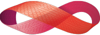

  
  
  
  

# GRiSP2 Robot

## Introduction

This project is an extension of the master thesis made by Francois Goens and Cédric Ponsard (link [here](https://github.com/FrancoisGgg/balancing_robot)). It is done in the context of a new master thesis by Nicolas Daube and Thomas Vanbever. The goal of this project is to use [GRISP2 boards](https://github.com/grisp/grisp) (designed and comercialised by [Peer Stritzinger GMBH.](https://stritzinger.com/)) and of the [Hera](https://github.com/Nicodaube/hera) framework to create a robot capable of standing upright (last master thesis) and to know its own position in an assembly of rooms (current project). 

The project is done using Erlang OTP (current version 27.2.4). If you want more informations about the, project, visit our the [Wiki](https://github.com/Nicodaube/Grisp_robot/wiki) section of this repository.

